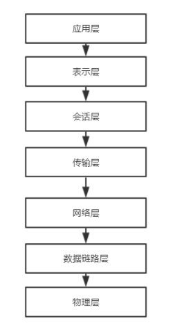

## 1.1 TCP/IP协议
##### TCP/IP协议
我们每天都会使用互联网，你是否想过互联网是什么？世界各地的计算机又是怎样完成通信的？在TCP/IP协议出现之前，经典的OSI参考模型经常被我们提起，这里简单介绍一下OSI参考模型如下图：

这是一个标准的OSI七层参考模型，采用服务与协议结合的模式，从下往上依次是：物理层、数据链路层、网络层、传输层、会话层、表示层、应用层。在20世纪80年代，大部分的专家都认为OSI参考模型将会成为全世界都流行的网络模型，但后来随着互联网的发展，人们逐渐认识到这种模型本身设计上存在的缺陷，在大多数应用中，会话层很少被用到，表示层几乎没有出现。由于服务与协议相结合，很多开发人员使用时变得复杂，实现起来变的困难。

为了使网络协议更加通俗易懂，TCP/IP协议被开发出来，TCP/IP参考模型采用五层来实现，也有的人习惯将参考模型拆分为四层，不同模型之间的关系如下图所示：本文以五层进行解释

下面依次从下往上介绍各层：
**a 物理层**
电脑之间进行通信，往往需要以某种介质传输信号，所以我们需要把电脑进行连接起来。可以用光缆、电缆、双绞线、无线电波等方式。作用是负责传输0和1的电信号。

**b 链路层**
我们知道，到达物理层时，0和1一定是经过解读过的，链路层便是这一个工作，链路层主要对0和1信号进行分组。那么如何分组，在早期有很多种方式，后来随着以太网的出现，以太网成了主流的方式，在以太网中规定，一组电信号构成数据包，叫做**“帧”（Frame）**。每一帧分成两个部分：标头和数据。

标头中包含了数据包中的说明，有发送者、接收者、数据类型等等，数据中存储的即是传输的数据。那么，在标头中说明的发送者和接收者又是什么，其实每台计算机在生产之后，生产商即规定了这台计算机的地址，且地址独一无二，我们称之为**MAC地址**，链路层在发送数据的时候采用广播的形式，在网内的所有计算机都会收到数据，计算机在收到数据之后，会和自身的MAC地址进行比较，如果相同，则接受，如果不同，则选择丢弃。

**c 网络层**
在以太网协议中，数据的传送只是局限于同一个网络。那如何在不同网络中进行通信呢，网络层解决了这一个问题，网络层区分哪些MAC地址处于同一网络，如果处于同一网络则采用广播的方式，如果不处于同一网络，采用路由方式。因此网络层的作用是引进一套新的地址，被称之为“网络地址”简称“网址”。网址的规定是由IP协议决定。因此也被称之为IP地址。IP协议的作用主要有两个，一个是为每一台计算机分配IP地址，另一个是确定哪些地址在同一个子网络。根据IP协议发送的数据包被称之为IP数据包，IP数据包也有标头和数据，IP数据包直接被放进链路层的数据中。

**d 传输层**
一台主机往往有很多程序在运行，当一个数据包发来之后，如何区分数据包中的内容在不同的程序之间正确分配呢？因此我们仍然需要一个标识来路由到具体的程序，我们称之为端口，计算机中的每个进程都有一个自己的端口，传输层之间的功能就是端口到端口之间的通信，现在我们需要一种新的协议来放端口信息的数据包，UDP协议或者TCP协议。

**e 应用层**
TCP协议可以为各种各样的程序传递数据，比如Email，FTP等等，那么在传输层中如何正确知道接收的数据来源？因此应用层在向传输层传递数据后规定了各种应用程序的数据格式。
